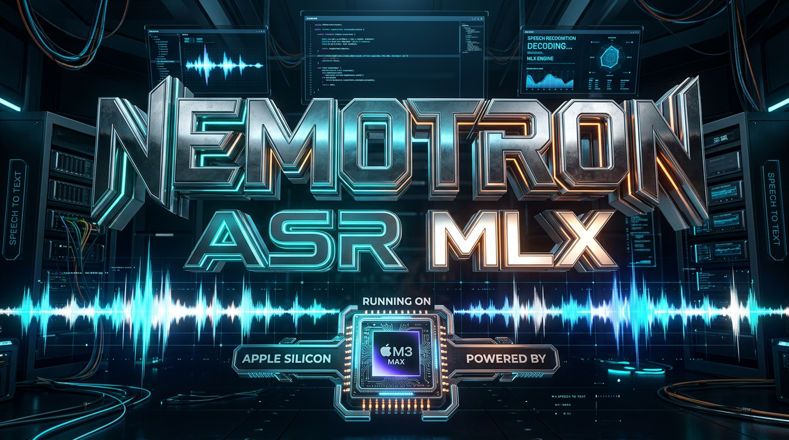

# nemotron-asr-mlx

<p align="center">
  
</p>

<p align="center">
  <strong>NVIDIA Nemotron ASR on Apple Silicon. 94x realtime. Pure MLX.</strong>
</p>

<p align="center">
  <a href="https://pypi.org/project/nemotron-asr-mlx/"></a>
  <a href="https://github.com/199-biotechnologies/nemotron-asr-mlx/blob/main/LICENSE"></a>
  <a href="https://www.python.org"></a>
</p>

---

93 minutes of audio transcribed in 59 seconds on an M-series Mac. No GPU drivers, no CUDA, no Docker. Just `pip install` and go.

This is a native [MLX](https://github.com/ml-explore/mlx) port of [NVIDIA's Nemotron-ASR 0.6B](https://huggingface.co/nvidia/nemotron-asr-speech-streaming-en-0.6b) — the cache-aware streaming conformer that processes each audio frame exactly once. No sliding windows, no recomputation, no rewinding. State lives in fixed-size ring buffers so latency stays flat no matter how long you talk.

```bash
pip install nemotron-asr-mlx
```

```python
from nemotron_asr_mlx import from_pretrained

model = from_pretrained("199-biotechnologies/nemotron-asr-mlx")
result = model.transcribe("meeting.wav")
print(result.text)
```

That's it. Model downloads on first run (~1.2 GB).

## Benchmark

Tested on Apple Silicon. All times are wall-clock inference only (no I/O).

| Content | Duration | Inference | Speed | Tokens |
|---------|----------|-----------|-------|--------|
| Short conversation | 5s | 0.09s | **55x** RT | 35 |
| Technical explainer | 98s | 1.04s | **95x** RT | 474 |
| Audiobook excerpt | 9s | 0.15s | **58x** RT | 57 |
| Long-form analysis | 25.6 min | 17.0s | **91x** RT | 10,572 |
| Lecture recording | 36.1 min | 23.5s | **92x** RT | 14,688 |
| Meeting recording | 29.4 min | 17.6s | **101x** RT | 7,796 |
| **Total** | **93.0 min** | **59.3s** | **94x** RT | **33,622** |

618.5M parameters. 3.4 GB peak GPU memory. Model loads in 0.1s after first download.

Run your own:

```bash
python benchmark.py /path/to/audio/files
```

## Why this exists

Most "streaming" ASR on Mac is either (a) Whisper with overlapping windows reprocessing the same audio over and over, or (b) cloud APIs adding network latency to every utterance. Nemotron's cache-aware conformer is architecturally different:

- **Each frame processed once** — state carried forward in fixed-size ring buffers, not recomputed
- **Constant memory** — no growing KV caches, no memory spikes on long recordings
- **Native Metal** — no PyTorch, no ONNX, no bridge layers. Direct MLX on Apple GPU
- **94x realtime** — an hour of audio in under a minute

The model achieves 2.43% WER on LibriSpeech test-clean, competitive with much larger models.

## Install

```bash
pip install nemotron-asr-mlx
```

Python 3.10+ and an Apple Silicon Mac.

## Usage

### CLI

```bash
nemotron-asr transcribe meeting.wav          # batch transcribe a file
nemotron-asr listen                          # stream from microphone
nemotron-asr listen --chunk-ms 80            # lowest latency streaming
```

### Python API

```python
from nemotron_asr_mlx import from_pretrained

model = from_pretrained("199-biotechnologies/nemotron-asr-mlx")

# Batch — transcribe a file or numpy array
result = model.transcribe("audio.wav")
print(result.text)
print(result.tokens)  # BPE token IDs

# Streaming — push audio chunks, get text back incrementally
session = model.create_stream(chunk_ms=160)
event = session.push(pcm_chunk)      # StreamEvent with text_delta
print(event.text_delta, end="")
final = session.flush()              # final result
session.reset()                      # reuse for next utterance

# Live mic streaming
with model.listen(chunk_ms=160) as stream:
    for event in stream:
        print(event.text_delta, end="", flush=True)
```

### StreamEvent

Every `push()` and `flush()` returns a `StreamEvent`:

| Field | Type | Description |
|-------|------|-------------|
| `text_delta` | `str` | New text since last event |
| `text` | `str` | Full accumulated text |
| `is_final` | `bool` | True only from `flush()` |
| `tokens` | `list[int]` | All accumulated BPE token IDs |

## Architecture

FastConformer encoder (24 layers, 1024-dim) with 8x depthwise striding subsampling. RNNT decoder with 2-layer LSTM prediction network and joint network. Per-layer-group attention context windows `[[70,13], [70,6], [70,1], [70,0]]` for progressive causal restriction. Greedy decoding with blank suppression.

Based on [Cache-aware Streaming Conformer](https://arxiv.org/abs/2312.17279) and the [NeMo](https://github.com/NVIDIA/NeMo) toolkit.

## Live Demo

A browser-based demo with live mic transcription:

```bash
pip install websockets
python demo/server.py
```

Open http://localhost:8765, click Record, and start speaking. Transcription updates in real-time with inference stats.

## Weight conversion

If you have a `.nemo` checkpoint and want to convert it yourself:

```bash
pip install torch safetensors pyyaml  # conversion deps only
nemotron-asr convert model.nemo ./output_dir
```

Produces `config.json` + `model.safetensors`. Conversion deps are not needed for inference.

## Dependencies

Deliberately minimal:

- `mlx` — Apple's ML framework
- `huggingface-hub` — model download
- `numpy` — mel spectrogram
- `sounddevice` — mic access (optional)
- `websockets` — live demo server (optional)
- `typer` — CLI

## License

Apache 2.0

## Author

[Boris Djordjevic](https://github.com/199-biotechnologies) / [199 Biotechnologies](https://github.com/199-biotechnologies)
